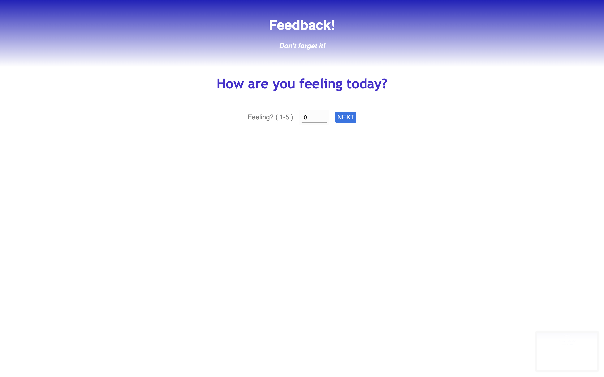
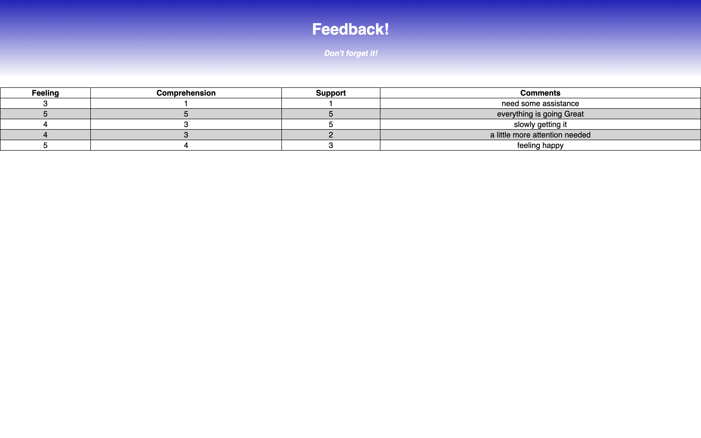

# Feedback-Loop

The goal was to create a multi-part form that allows users to leave feedback for today. 
There had to be a different view for each question.  
Even without a nav bar, each part of the form should be at its own route. Clicking next should move the user to the appropriate step in the process.

The review page needed to show all results and hitting the 'submit' button needed to posts all the results in the database while showing the results to the user and giving the user the ablilty to go through the site again.

There also needed to be an admin page, that can be obtained by going to /admin where past results are shown in a table.

## Prerequisites
<ul>
    <li>Node.js</li>
    <li>React.js</li>
    <li>React.js Redux</li>
    <li>Express</li>
    <li>Postico</li>
</ul>

## Screen Shot

## Installation
<ol>
<li>Create a database named "prime_feedback"</li>
<li>The queries in the database.sql file are set up to create all the necessary tables and populate the needed data to allow the application to run correctly. The project is built on Postgres, so you will need to make sure to have that installed. We recommend using Postico to run those queries as that was used to create the queries,</li>
<li>Open up your editor of choice and run an npm install</li>
<!-- <li>Run an npm install redux@4 react-redux@7 redux-logger@3</li> -->
<li>Run npm run server in your terminal</li>
<li>Run npm run client in your terminal</li>
<li>The npm run client command will open up a new browser tab for you!</li>
